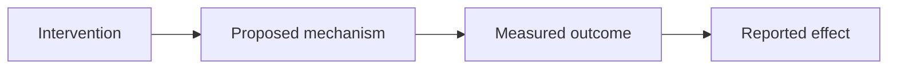

When Consensus writes an analysis in [Pro Search](/web/pro-search) or [Deep review](/web/deep-review), it can include a diagram alongside the text. A diagram helps you see the shape of the evidence, such as how findings relate or how a process unfolds, instead of reading it all in prose.

## What the analysis can draw

The analysis can render diagrams, including **Mermaid** diagrams, to visualize relationships and processes in the evidence. Two common cases:

- **A process**: the steps or stages described across the papers, in order.
- **A comparison**: how approaches, groups, or findings relate to one another.

<Note>
  Diagrams are part of a Pro or Deep analysis. Quick Search returns a ranked list with one-sentence takeaways and does not generate diagrams.
</Note>

## Ask for a diagram

You can prompt the analysis to produce a diagram as part of your question. Add a short instruction to your query, for example:

- "Summarize the evidence on intermittent fasting and include a diagram of the metabolic process."
- "Compare the main treatment options and show how they relate as a diagram."

The analysis chooses what best fits the evidence, so the exact diagram can vary from one run to the next.

## What a diagram looks like

Diagrams render inline in the analysis. A process diagram, for example, might look like this:

<Tip>
  A diagram is a way to read the analysis faster, not a replacement for it. Use the diagram to orient yourself, then read the surrounding text and open the cited papers for the detail.
</Tip>

## Where diagrams appear

<CardGroup cols={2}>
  <Card title="Pro Search" icon="wand-magic-sparkles" href="/web/pro-search">
    Analyzes up to 20 papers and writes a connected summary. Ask it to include a diagram.
  </Card>
  <Card title="Deep review" icon="book-open-reader" href="/web/deep-review">
    Runs a structured literature review across up to 50 papers, where a diagram can map the whole picture.
  </Card>
</CardGroup>
