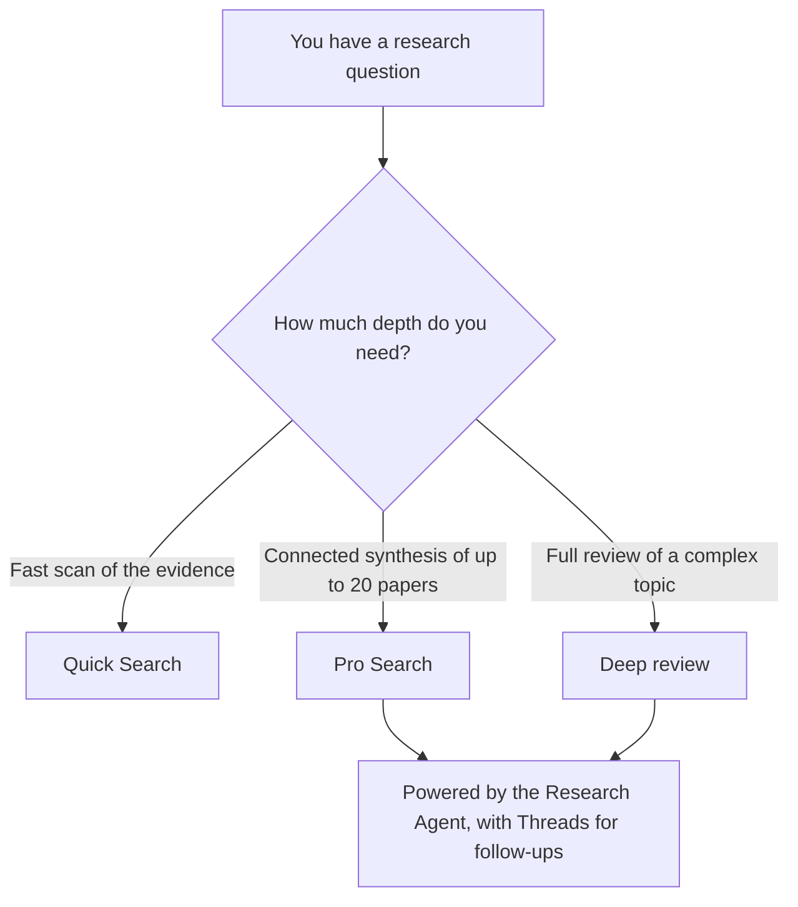

Consensus has three search modes, and they differ by one thing: how deep you want to go. **Quick Search** gives you a fast scan of the evidence, **Pro Search** connects findings across up to 20 papers, and **Deep review** produces a full literature review of a complex topic.

Two capabilities sit inside the deeper modes rather than standing on their own. The **Research Agent** is the engine that powers both Pro Search and Deep review, and **Threads** let you ask follow-up questions in Pro and Deep without starting over. Neither is a mode you pick; you get them by running Pro or Deep.

## Pick a mode by depth

## The three modes

| Mode | What it does | Best for |
| --- | --- | --- |
| **Quick Search** | Returns a ranked list of the most relevant papers, each with a one-sentence AI takeaway. | A fast scan of the evidence. |
| **Pro Search** | Analyzes up to 20 papers and writes a thoughtful summary that connects findings across them. | A synthesis of a focused question. |
| **Deep review** | Breaks your question into sub-questions, runs up to roughly 20 targeted searches, and synthesizes a structured review across up to 50 papers. | A full literature review of a complex topic. |

## What powers Pro and Deep

<Info>
  The **Research Agent** and **Threads** are capabilities inside Pro Search and Deep review, not separate modes. You do not select them; you get them whenever you run Pro or Deep.
</Info>

- **Research Agent**: understands messy prompts, precise questions, and Boolean-style queries, then plans and runs multiple sub-searches, uses tools such as citation crawling and author search, applies academic filters, and reads and compares papers to surface findings. See [Research Agent](/web/research-agent).
- **Threads**: ask follow-up questions within the same search while keeping context, instead of starting a new one. See [Threads and follow-ups](/web/threads).

## Explore each mode

<CardGroup cols={2}>
  <Card title="Quick Search" icon="bolt" href="/web/quick-search">
    The default fast mode: ranked papers with one-sentence takeaways.
  </Card>
  <Card title="Pro Search" icon="wand-magic-sparkles" href="/web/pro-search">
    Up to 20 papers, synthesized into a connected summary.
  </Card>
  <Card title="Deep review" icon="book-open-reader" href="/web/deep-review">
    A structured literature review across up to 50 papers.
  </Card>
  <Card title="Research Agent" icon="robot" href="/web/research-agent">
    The engine that plans and runs the searches inside Pro and Deep.
  </Card>
  <Card title="Threads and follow-ups" icon="comments" href="/web/threads">
    Keep asking questions in Pro and Deep without losing context.
  </Card>
</CardGroup>

<Note>
  Every mode is available to try. Deeper modes and higher search volumes scale with your plan. Compare what each plan unlocks on the [Plans](/web/plans) page, and see current limits on the [pricing page](https://consensus.app/pricing).
</Note>
